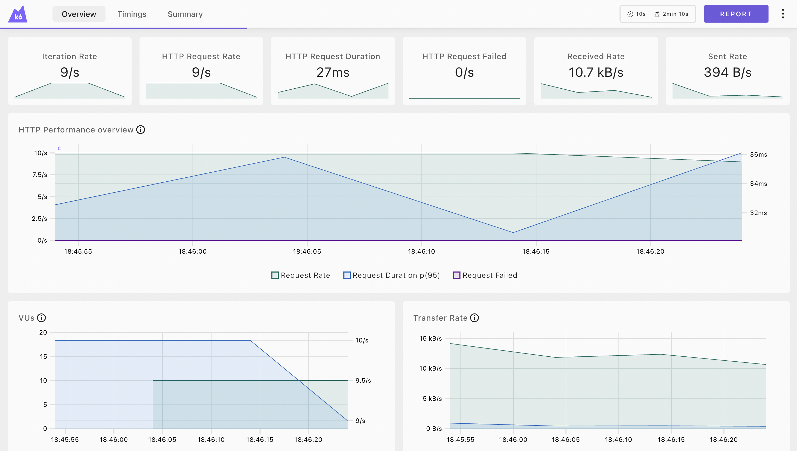

# Performance Testing - K6
```
          /\      |‾‾| /‾‾/   /‾‾/
     /\  /  \     |  |/  /   /  /
    /  \/    \    |     (   /   ‾‾\
   /          \   |  |\  \ |  (‾)  |
  / __________ \  |__| \__\ \_____/ .io
```

### Pre-requisite
[](https://grafana.com/docs/k6/latest/set-up/install-k6/)
[](https://nodejs.org/en/download/)
[](https://code.visualstudio.com/download)

### Getting Started
```
git clone https://github.com/sadabnepal/k6-performance-testing.git
cd k6-performance-testing
```


### Install K6
```
npm install
npm run setup:unix    [ mac/linux using homebrew ]
npm run setup:windows [ windows ]
```
[Install k6 | Grafana k6 documentation](https://grafana.com/docs/k6/latest/set-up/install-k6/)

### K6 extension for VS code
Once you open the cloned repository in visual studio code, you will get popup to install recommended extension. Download the extension for better intellisense support.

### K6 Code generator
[K6 Studio](https://grafana.com/docs/k6/latest/k6-studio/)
If you’re unfamiliar with JavaScript/TypeScript languages, check out k6 Studio, which helps users generate tests without writing code. Alternatively


### Run Test commands
```
npm run testGet
npm run testPost
npm run testPut
npm run testPatch
npm run testWithVirtualUsers
npm run test
```

### Sample Report:

